# actually useful or otherwise interesting

## 2025-03-01 keyboard mouse blocker

I use a Kinesis split keyboard (Freestyle Edge) with a lift kit that raises the halves of the keyboard by a small angle for ergonomics. I also use a Logitech MX Master 3 mouse. When moving the mouse, I found that I frequently hit the left mouse button against the keyboard, inadvertantly clicking the mouse whereever it happens to be on screen. This is super annoying. So I decided to build a guard to prevent the mouse button from being hit. This took a few iterations to get the dimensions right.

With the print in place and attached to the keyboard wrist pad from the underside, the part of the mouse _underneath_ the button will collide with the print first. This prevents the left mouse button from being inadvertantly clicked.

<!-- AUTOGEN:START 2025-03-01 keyboard mouse blocker -->

**Files:**

- SCAD: [2025-03-01 keyboard mouse blocker.scad](2025-03-01%20keyboard%20mouse%20blocker.scad)
- STL: [2025-03-01 keyboard mouse blocker.stl](2025-03-01%20keyboard%20mouse%20blocker.stl)
<!-- AUTOGEN:END 2025-03-01 keyboard mouse blocker -->

## 2025-03-02 door handle thumb lever

My door handle thumb lever broke as shown in the picture. Even though it was a pretty tough piece of metal, printing a replacement worked in a pinch.

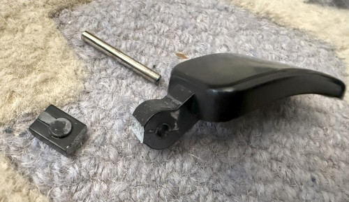
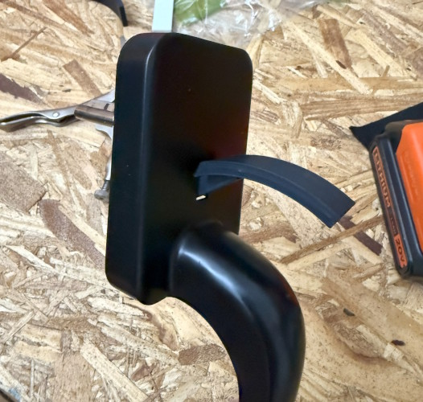

<!-- AUTOGEN:START 2025-03-02 door handle thumb lever -->

**Files:**

- SCAD: [2025-03-02 door handle thumb lever.scad](2025-03-02%20door%20handle%20thumb%20lever.scad)
- STL: [2025-03-02 door handle thumb lever.stl](2025-03-02%20door%20handle%20thumb%20lever.stl)
- 3MF: [2025-03-02 door handle thumb lever.3mf](2025-03-02%20door%20handle%20thumb%20lever.3mf)
<!-- AUTOGEN:END 2025-03-02 door handle thumb lever -->

## 2025-03-12 pocket door handle helper

<!-- AUTOGEN:START 2025-03-12 pocket door handle helper -->

**Files:**

- SCAD: [2025-03-12 pocket door handle helper.scad](2025-03-12%20pocket%20door%20handle%20helper.scad)
- STL: [2025-03-12 pocket door handle helper.stl](2025-03-12%20pocket%20door%20handle%20helper.stl)
<!-- AUTOGEN:END 2025-03-12 pocket door handle helper -->

## 2025-03-25 desk gizmo

Desk gizmo accomplishes two things: it keeps my phone/earbud/watch charger in place on the desk, and it provides tactile guardrails to the capacative buttons on my standing desk, also helping to prevent accidental presses.

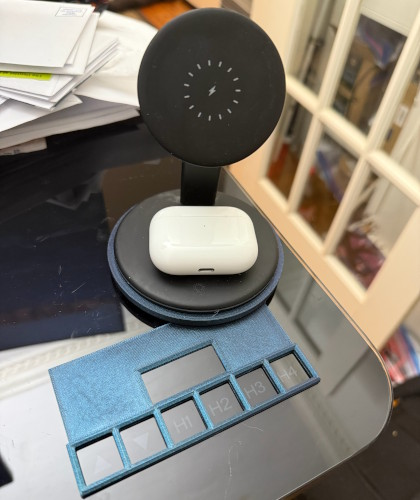

<!-- AUTOGEN:START 2025-03-25 desk gizmo -->

**Files:**

- SCAD: [2025-03-25 desk gizmo.scad](2025-03-25%20desk%20gizmo.scad)
- STL: [2025-03-25 desk gizmo.stl](2025-03-25%20desk%20gizmo.stl)
<!-- AUTOGEN:END 2025-03-25 desk gizmo -->

## 2025-06-20 new tesla phone holder

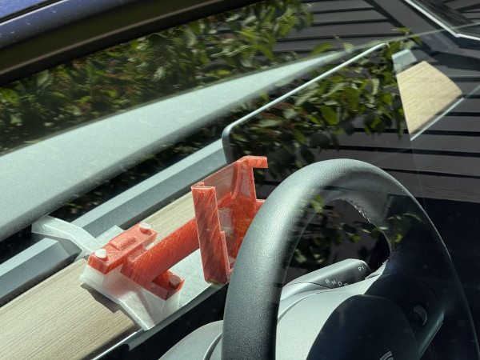
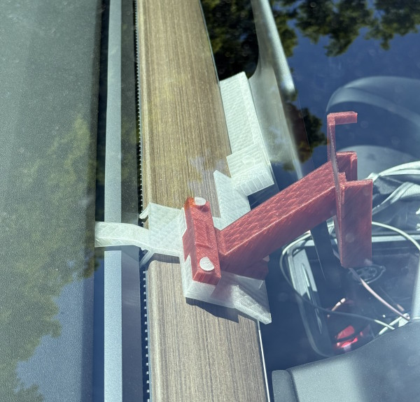

<!-- AUTOGEN:START 2025-06-20 new tesla phone holder -->

**Files:**

- SCAD: [2025-06-20 new tesla phone holder.scad](2025-06-20%20new%20tesla%20phone%20holder.scad)
- STL: [2025-06-20 new tesla phone holder.stl](2025-06-20%20new%20tesla%20phone%20holder.stl)
<!-- AUTOGEN:END 2025-06-20 new tesla phone holder -->

## 2025-07-02 poop bucket with obstacle

Waste filament collector for my Bambu A1 mini.

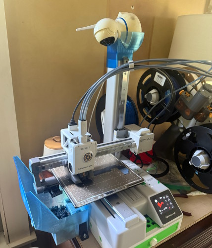

<!-- AUTOGEN:START 2025-07-02 poop bucket with obstacle -->

**Files:**

- SCAD: [2025-07-02 poop bucket with obstacle.scad](2025-07-02%20poop%20bucket%20with%20obstacle.scad)
- STL: [2025-07-02 poop bucket with obstacle.stl](2025-07-02%20poop%20bucket%20with%20obstacle.stl)
<!-- AUTOGEN:END 2025-07-02 poop bucket with obstacle -->

## 2025-07-05 webcam vs printer holder

This holds a Wansview webcam in a spot where it can view the bed pretty clearly. See the picture for the poop bucket.

<!-- AUTOGEN:START 2025-07-05 webcam vs printer holder -->

**Files:**

- SCAD: [2025-07-05 webcam vs printer holder.scad](2025-07-05%20webcam%20vs%20printer%20holder.scad)
- STL: [2025-07-05 webcam vs printer holder.stl](2025-07-05%20webcam%20vs%20printer%20holder.stl)
<!-- AUTOGEN:END 2025-07-05 webcam vs printer holder -->

## 2025-07-09 laptop keyboard guard clip

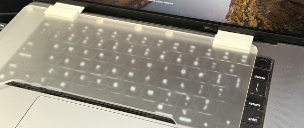

<!-- AUTOGEN:START 2025-07-09 laptop keyboard guard clip -->

**Files:**

- SCAD: [2025-07-09 laptop keyboard guard clip.scad](2025-07-09%20laptop%20keyboard%20guard%20clip.scad)
- STL: [2025-07-09 laptop keyboard guard clip.stl](2025-07-09%20laptop%20keyboard%20guard%20clip.stl)
<!-- AUTOGEN:END 2025-07-09 laptop keyboard guard clip -->

## 2025-07-24 rotating vesa mount

This allows me to quickly rotate my digital picture frame between landscape and portrait depending on the selected picture.

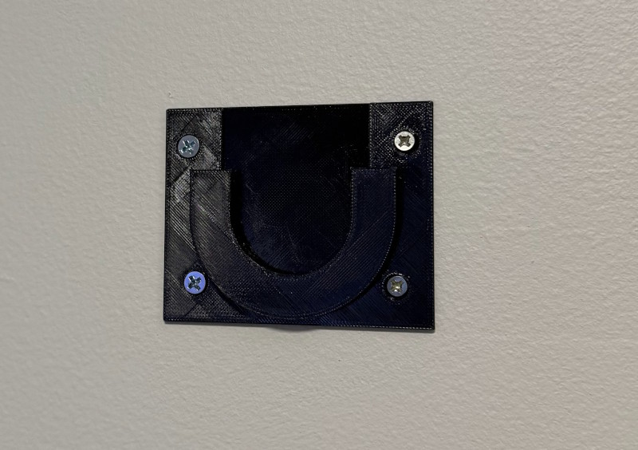
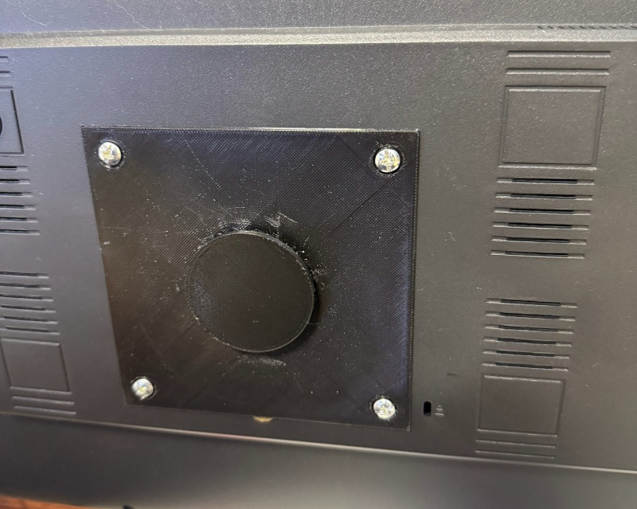
<!-- AUTOGEN:START 2025-07-24 rotating vesa mount -->

**Files:**

- SCAD: [2025-07-24 rotating vesa mount.scad](2025-07-24%20rotating%20vesa%20mount.scad)
- STL: [2025-07-24 rotating vesa mount.stl](2025-07-24%20rotating%20vesa%20mount.stl)
<!-- AUTOGEN:END 2025-07-24 rotating vesa mount -->

## 2025-07-26 microcontroller enclosure

This is for the lighting of my office floor project.

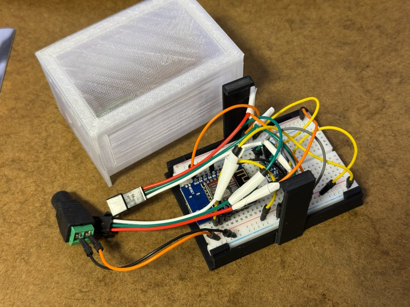

<!-- AUTOGEN:START 2025-07-26 microcontroller enclosure -->

**Files:**

- SCAD: [2025-07-26 microcontroller enclosure.scad](2025-07-26%20microcontroller%20enclosure.scad)
- STL: [2025-07-26 microcontroller enclosure.stl](2025-07-26%20microcontroller%20enclosure.stl)
<!-- AUTOGEN:END 2025-07-26 microcontroller enclosure -->

## 2025-08-15 apollo 11 frame mount

<!-- AUTOGEN:START 2025-08-15 apollo 11 frame mount -->

**Files:**

- SCAD: [2025-08-15 apollo 11 frame mount.scad](2025-08-15%20apollo%2011%20frame%20mount.scad)
- STL: [2025-08-15 apollo 11 frame mount.stl](2025-08-15%20apollo%2011%20frame%20mount.stl)
<!-- AUTOGEN:END 2025-08-15 apollo 11 frame mount -->

## 2025-08-17 formula bag apparatus

It's a stand to keep the enteral formula bag upright while you pour liquids and squeeze formula bags into it, which often takes two hands.

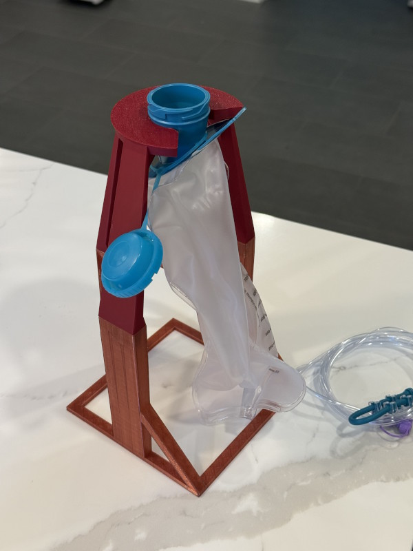
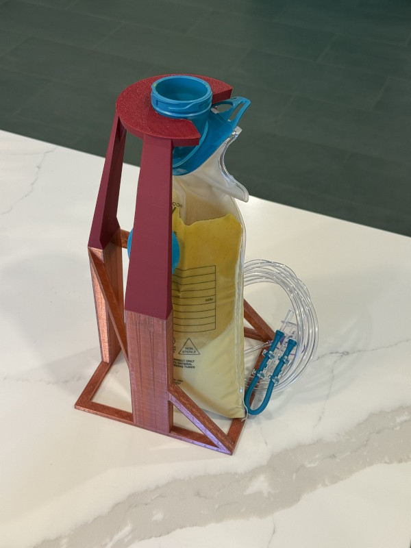

<!-- AUTOGEN:START 2025-08-17 formula bag apparatus -->

**Files:**

- SCAD: [2025-08-17 formula bag apparatus.scad](2025-08-17%20formula%20bag%20apparatus.scad)
- STL: [2025-08-17 formula bag apparatus.stl](2025-08-17%20formula%20bag%20apparatus.stl)
<!-- AUTOGEN:END 2025-08-17 formula bag apparatus -->

## 2025-08-21 fingerbot case

<!-- AUTOGEN:START 2025-08-21 fingerbot case -->

**Files:**

- SCAD: [2025-08-21 fingerbot case.scad](2025-08-21%20fingerbot%20case.scad)
- STL: [2025-08-21 fingerbot case.stl](2025-08-21%20fingerbot%20case.stl)
<!-- AUTOGEN:END 2025-08-21 fingerbot case -->

## 2025-08-23 finger pusher

<!-- AUTOGEN:START 2025-08-23 finger pusher -->

**Files:**

- SCAD: [2025-08-23 finger pusher.scad](2025-08-23%20finger%20pusher.scad)
- STL: [2025-08-23 finger pusher.stl](2025-08-23%20finger%20pusher.stl)
<!-- AUTOGEN:END 2025-08-23 finger pusher -->

## 2025-08-30 syringe press v3

<!-- AUTOGEN:START 2025-08-30 syringe press v3 -->

**Files:**

- SCAD: [2025-08-30 syringe press v3.scad](2025-08-30%20syringe%20press%20v3.scad)
- STL: [2025-08-30 syringe press v3.stl](2025-08-30%20syringe%20press%20v3.stl)
<!-- AUTOGEN:END 2025-08-30 syringe press v3 -->

## 2025-09-06 extension pliers

Not sure why I called these "pliers," but you can use this as a wrench for opening the port on an extension when it's too tight.

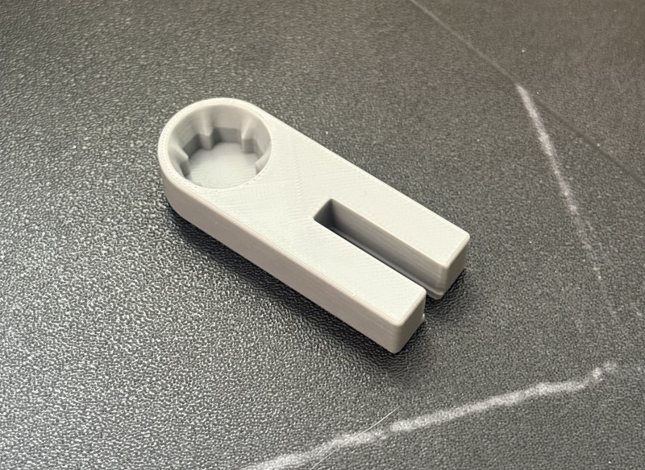
<!-- AUTOGEN:START 2025-09-06 extension pliers -->

**Files:**

- SCAD: [2025-09-06 extension pliers.scad](2025-09-06%20extension%20pliers.scad)
- STL: [2025-09-06 extension pliers.stl](2025-09-06%20extension%20pliers.stl)
<!-- AUTOGEN:END 2025-09-06 extension pliers -->

## 2025-09-20 cat litter scoop holder

Cat litter scoop holder compatible with [this cat litter scoop from Amazon](https://www.amazon.com/dp/B0CBHTHW9W/?coliid=I9AY0CRHJ0H1U&colid=15LO7KVVDPPE4&ref_=list_c_wl_lv_ov_lig_dp_it&th=1).

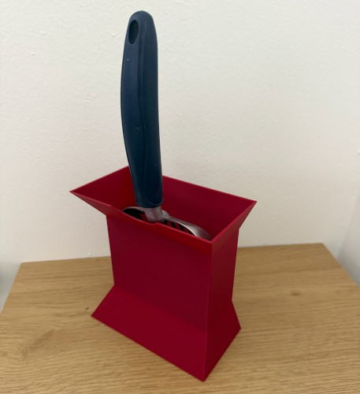

<!-- AUTOGEN:START 2025-09-20 cat litter scoop holder -->

**Files:**

- SCAD: [2025-09-20 cat litter scoop holder.scad](2025-09-20%20cat%20litter%20scoop%20holder.scad)
- STL: [2025-09-20 cat litter scoop holder.stl](2025-09-20%20cat%20litter%20scoop%20holder.stl)
<!-- AUTOGEN:END 2025-09-20 cat litter scoop holder -->

## 2025-09-21 syringe grip

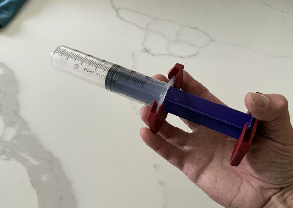

<!-- AUTOGEN:START 2025-09-21 syringe grip -->

**Files:**

- SCAD: [2025-09-21 syringe grip.scad](2025-09-21%20syringe%20grip.scad)
- STL: [2025-09-21 syringe grip.stl](2025-09-21%20syringe%20grip.stl)
<!-- AUTOGEN:END 2025-09-21 syringe grip -->

## 2025-09-28 picture frame wire wall caps

<!-- AUTOGEN:START 2025-09-28 picture frame wire wall caps -->

**Files:**

- SCAD: [2025-09-28 picture frame wire wall caps.scad](2025-09-28%20picture%20frame%20wire%20wall%20caps.scad)
- STL: [2025-09-28 picture frame wire wall caps.stl](2025-09-28%20picture%20frame%20wire%20wall%20caps.stl)
<!-- AUTOGEN:END 2025-09-28 picture frame wire wall caps -->

## 2025-10-12 display case corner pieces

These are supposed to join 3 acrylic sheets together at a corner. They're about as compact as possible for 3d printing, and there's still a fairly big gap between sheets on each edge. In the future I'm thinking I should instead make joiners between 2 sheets at an edge instead of joiners for 3 sheets a at corner.

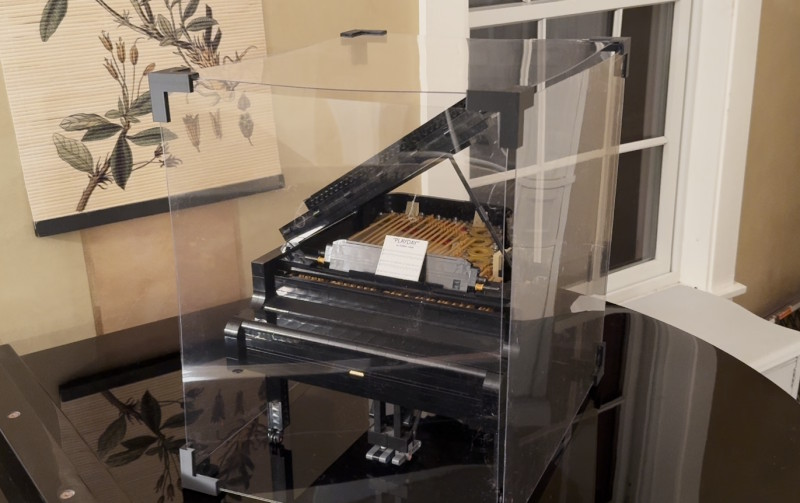

<!-- AUTOGEN:START 2025-10-12 display case corner pieces -->

**Files:**

- SCAD: [2025-10-12 display case corner pieces.scad](2025-10-12%20display%20case%20corner%20pieces.scad)
- STL: [2025-10-12 display case corner pieces.stl](2025-10-12%20display%20case%20corner%20pieces.stl)
<!-- AUTOGEN:END 2025-10-12 display case corner pieces -->

## 2025-10-12 kian knife sheath

<!-- AUTOGEN:START 2025-10-12 kian knife sheath -->

**Files:**

- SCAD: [2025-10-12 kian knife sheath.scad](2025-10-12%20kian%20knife%20sheath.scad)
- STL: [2025-10-12 kian knife sheath.stl](2025-10-12%20kian%20knife%20sheath.stl)
<!-- AUTOGEN:END 2025-10-12 kian knife sheath -->

## 2025-11-23 battery cover

Lost the battery cover to this touchless trash can.

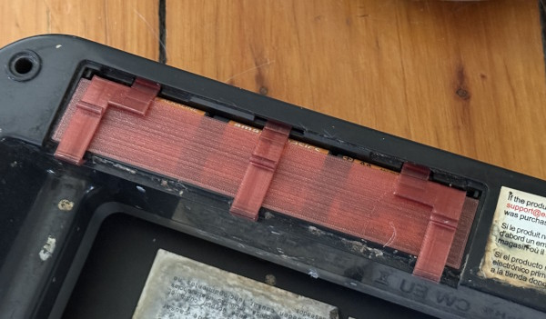

<!-- AUTOGEN:START 2025-11-23 battery cover -->

**Files:**

- SCAD: [2025-11-23 battery cover.scad](2025-11-23%20battery%20cover.scad)
- STL: [2025-11-23 battery cover.stl](2025-11-23%20battery%20cover.stl)
<!-- AUTOGEN:END 2025-11-23 battery cover -->

## 2025-11-27 tripod mount shoe

This allows a webcam to be pointed directly at my gas meter for the [utilities-monitor dashboard](https://github.com/esirko/utilities-monitor-dashboard). It mounts to an Amazon Basics tripod.

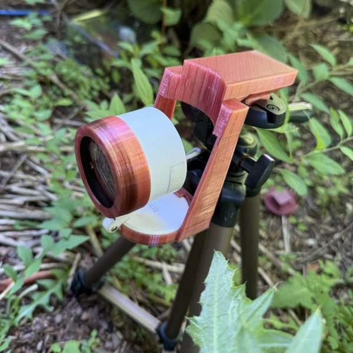

<!-- AUTOGEN:START 2025-11-27 tripod mount shoe -->

**Files:**

- SCAD: [2025-11-27 tripod mount shoe.scad](2025-11-27%20tripod%20mount%20shoe.scad)
- STL: [2025-11-27 tripod mount shoe.stl](2025-11-27%20tripod%20mount%20shoe.stl)
<!-- AUTOGEN:END 2025-11-27 tripod mount shoe -->

## 2025-11-28 pole hugger for camera mount in basement

This allows a webcam to be pointed directly at the water meter for the [utilities-monitor dashboard](https://github.com/esirko/utilities-monitor-dashboard). I tried to make the mechanism to "attach" to the pole general.

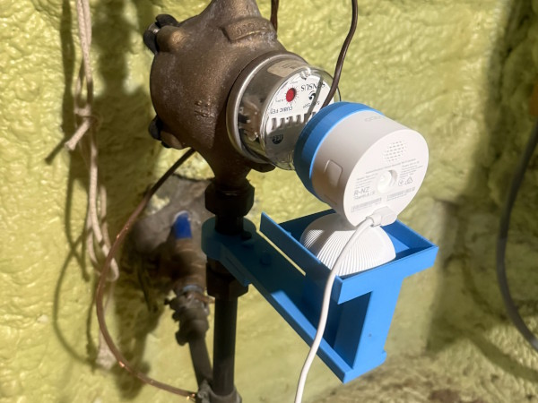

<!-- AUTOGEN:START 2025-11-28 pole hugger for camera mount in basement -->

**Files:**

- SCAD: [2025-11-28 pole hugger for camera mount in basement.scad](2025-11-28%20pole%20hugger%20for%20camera%20mount%20in%20basement.scad)
- STL: [2025-11-28 pole hugger for camera mount in basement.stl](2025-11-28%20pole%20hugger%20for%20camera%20mount%20in%20basement.stl)
<!-- AUTOGEN:END 2025-11-28 pole hugger for camera mount in basement -->

## 2025-12-05 lens clamps for ip cams

For [utilities-monitor dashboard](https://github.com/esirko/utilities-monitor-dashboard), this attaches a [diopter lens](https://www.amazon.com/Vivitar-Close-Up-Macro-Filter-Pouch/dp/B004DRCEDW) to a tapo IP camera ([C113](https://www.amazon.com/Tapo-Indoor-Outdoor-Security-Camera/dp/B0F58PRJXV) or [C120](https://www.amazon.com/Tapo-cameras-for-home-security/dp/B0CH45HPZT)). The circle part should be enough and fit snugly. The tripod part isn't necessary.

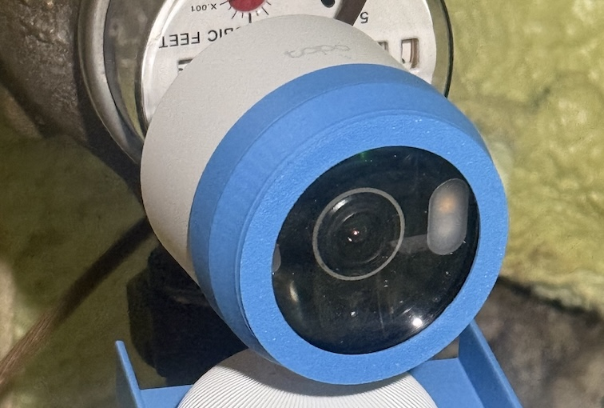

<!-- AUTOGEN:START 2025-12-05 lens clamps for ip cams -->

**Files:**

- SCAD: [2025-12-05 lens clamps for ip cams.scad](2025-12-05%20lens%20clamps%20for%20ip%20cams.scad)
- STL: [2025-12-05 lens clamps for ip cams.stl](2025-12-05%20lens%20clamps%20for%20ip%20cams.stl)
<!-- AUTOGEN:END 2025-12-05 lens clamps for ip cams -->

## 2025-12-18 cat food measuring cup

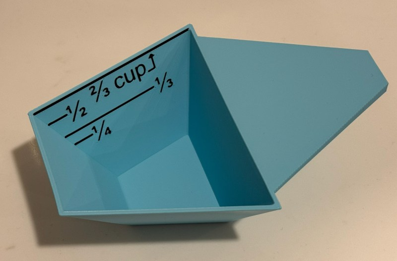

<!-- AUTOGEN:START 2025-12-18 cat food measuring cup -->

**Files:**

- SCAD: [2025-12-18 cat food measuring cup.scad](2025-12-18%20cat%20food%20measuring%20cup.scad)
- STL: [2025-12-18 cat food measuring cup.stl](2025-12-18%20cat%20food%20measuring%20cup.stl)
- Variant STL: [2025-12-18 cat food measuring cup - text.stl](2025-12-18%20cat%20food%20measuring%20cup%20-%20text.stl)
<!-- AUTOGEN:END 2025-12-18 cat food measuring cup -->

## 2025-12-28 coffee maker lid holder 2

<!-- AUTOGEN:START 2025-12-28 coffee maker lid holder 2 -->

**Files:**

- SCAD: [2025-12-28 coffee maker lid holder 2.scad](2025-12-28%20coffee%20maker%20lid%20holder%202.scad)
- STL: [2025-12-28 coffee maker lid holder 2.stl](2025-12-28%20coffee%20maker%20lid%20holder%202.stl)
<!-- AUTOGEN:END 2025-12-28 coffee maker lid holder 2 -->

## 2025-12-29 5-gallon water jug funnel attachment

It's a pretty good fit to the 5-gallon jug. Could be just a tad tighter.

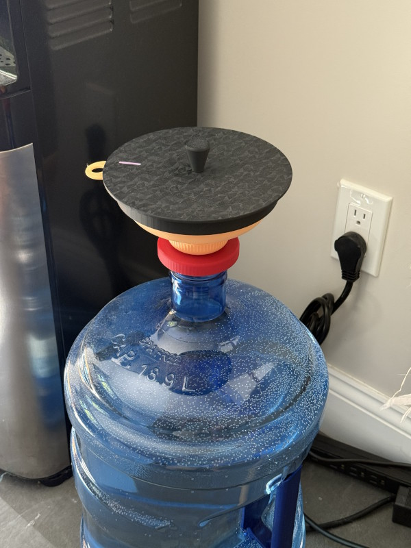
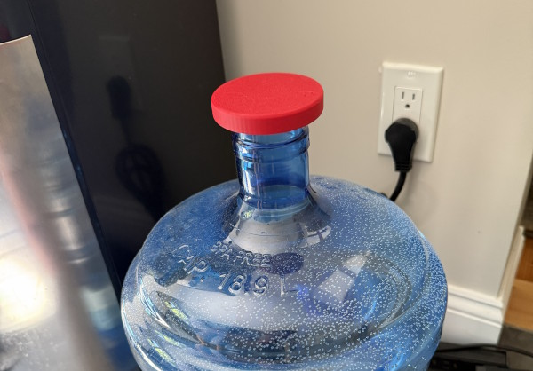

<!-- AUTOGEN:START 2025-12-29 5-gallon water jug funnel attachment -->

**Files:**

- SCAD: [2025-12-29 5-gallon water jug funnel attachment.scad](2025-12-29%205-gallon%20water%20jug%20funnel%20attachment.scad)
- STL: [2025-12-29 5-gallon water jug funnel attachment.stl](2025-12-29%205-gallon%20water%20jug%20funnel%20attachment.stl)
- Variant STL: [2025-12-29 5-gallon water jug funnel attachment - line.stl](2025-12-29%205-gallon%20water%20jug%20funnel%20attachment%20-%20line.stl)
<!-- AUTOGEN:END 2025-12-29 5-gallon water jug funnel attachment -->

## 2025-12-29 sad light stand 2

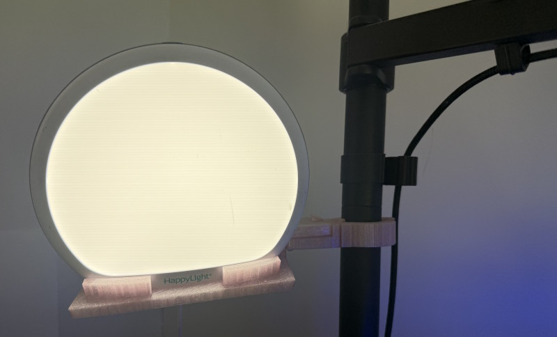

<!-- AUTOGEN:START 2025-12-29 sad light stand 2 -->

**Files:**

- SCAD: [2025-12-29 sad light stand 2.scad](2025-12-29%20sad%20light%20stand%202.scad)
- STL: [2025-12-29 sad light stand 2.stl](2025-12-29%20sad%20light%20stand%202.stl)
<!-- AUTOGEN:END 2025-12-29 sad light stand 2 -->

## 2025-12-29 strainer

Fits my Kohler sink. Costs about 50 cents in filament, and when it gets disgusting I can just throw it out. The spiral structure on the bottom (hard to see in these photos) makes the water do a cool whirlpool effect when draining.

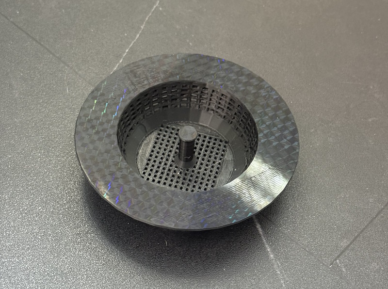

<!-- AUTOGEN:START 2025-12-29 strainer -->

**Files:**

- SCAD: [2025-12-29 strainer.scad](2025-12-29%20strainer.scad)
- STL: [2025-12-29 strainer.stl](2025-12-29%20strainer.stl)
<!-- AUTOGEN:END 2025-12-29 strainer -->

## 2026-01-19 kaiacam holder

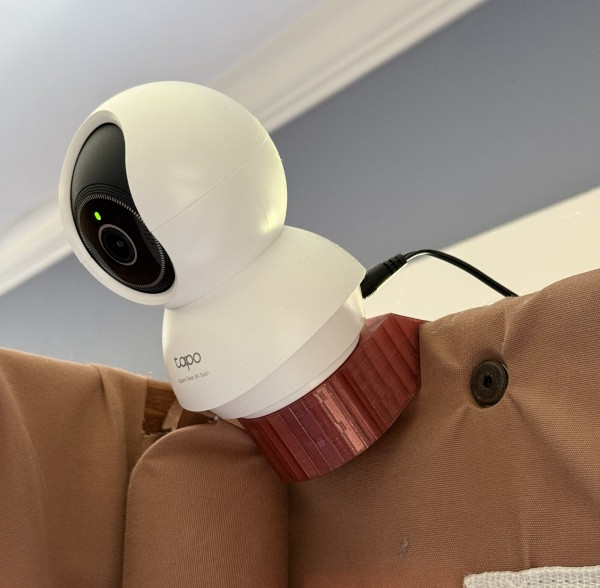
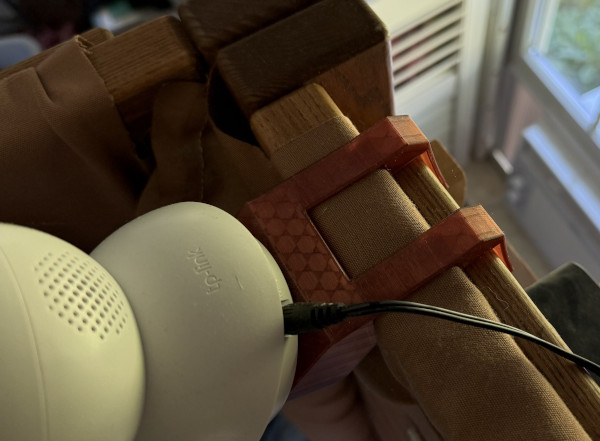

<!-- AUTOGEN:START 2026-01-19 kaiacam holder -->

**Files:**

- SCAD: [2026-01-19 kaiacam holder.scad](2026-01-19%20kaiacam%20holder.scad)
- STL: [2026-01-19 kaiacam holder.stl](2026-01-19%20kaiacam%20holder.stl)
<!-- AUTOGEN:END 2026-01-19 kaiacam holder -->

## 2026-02-07 2x4 holder for snowblower ramp

It has a little notch for wedging in between planks so it doesn't slip. I also used this for getting the snowblower into my car when I needed to get it serviced.

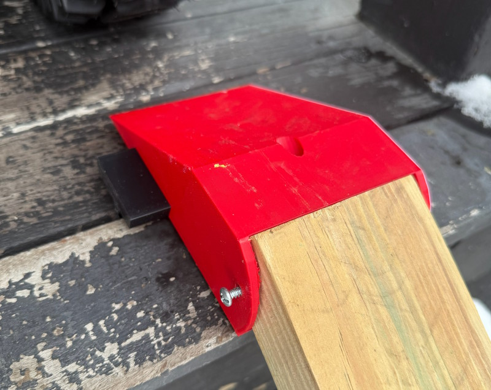
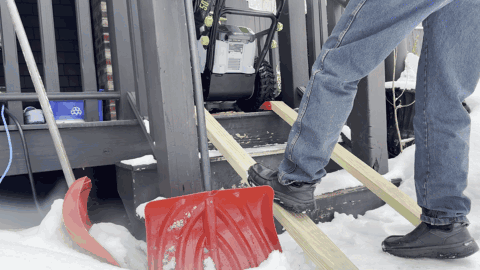

<!-- AUTOGEN:START 2026-02-07 2x4 holder for snowblower ramp -->

**Files:**

- SCAD: [2026-02-07 2x4 holder for snowblower ramp.scad](2026-02-07%202x4%20holder%20for%20snowblower%20ramp.scad)
- STL: [2026-02-07 2x4 holder for snowblower ramp.stl](2026-02-07%202x4%20holder%20for%20snowblower%20ramp.stl)
<!-- AUTOGEN:END 2026-02-07 2x4 holder for snowblower ramp -->

## 2026-02-14 kaia bed lock

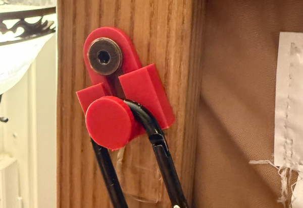

<!-- AUTOGEN:START 2026-02-14 kaia bed lock -->

**Files:**

- SCAD: [2026-02-14 kaia bed lock.scad](2026-02-14%20kaia%20bed%20lock.scad)
- STL: [2026-02-14 kaia bed lock.stl](2026-02-14%20kaia%20bed%20lock.stl)
<!-- AUTOGEN:END 2026-02-14 kaia bed lock -->

## 2026-02-18 voice recorder case

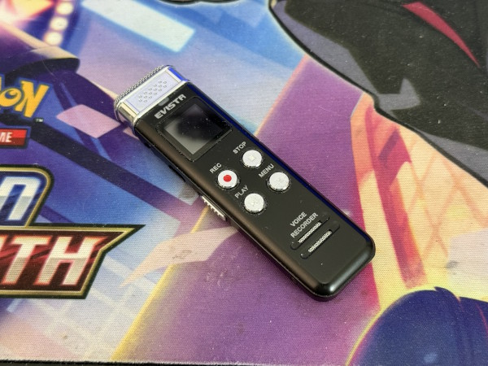
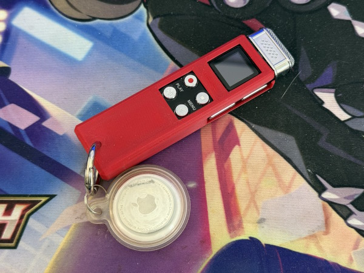

<!-- AUTOGEN:START 2026-02-18 voice recorder case -->

**Files:**

- SCAD: [2026-02-18 voice recorder case.scad](2026-02-18%20voice%20recorder%20case.scad)
- STL: [2026-02-18 voice recorder case.stl](2026-02-18%20voice%20recorder%20case.stl)
<!-- AUTOGEN:END 2026-02-18 voice recorder case -->

## 2026-04-08 piano cam holder

<!-- AUTOGEN:START 2026-04-08 piano cam holder -->

**Files:**

- SCAD: [2026-04-08 piano cam holder.scad](2026-04-08%20piano%20cam%20holder.scad)
- STL: [2026-04-08 piano cam holder.stl](2026-04-08%20piano%20cam%20holder.stl)
<!-- AUTOGEN:END 2026-04-08 piano cam holder -->

## 2026-04-25 lava lamp snake cover

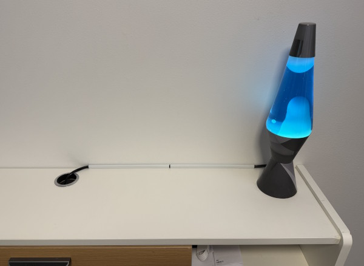

<!-- AUTOGEN:START 2026-04-25 lava lamp snake cover -->

**Files:**

- SCAD: [2026-04-25 lava lamp snake cover.scad](2026-04-25%20lava%20lamp%20snake%20cover.scad)
- STL: [2026-04-25 lava lamp snake cover.stl](2026-04-25%20lava%20lamp%20snake%20cover.stl)
<!-- AUTOGEN:END 2026-04-25 lava lamp snake cover -->

## 2026-04-25 monstera pot holder

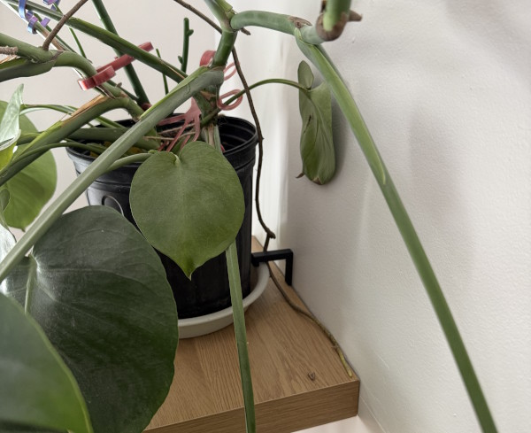
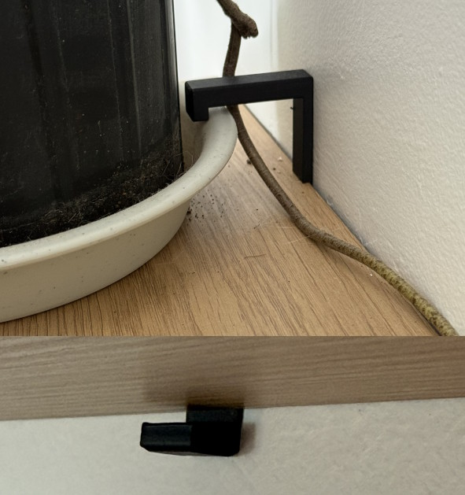

<!-- AUTOGEN:START 2026-04-25 monstera pot holder -->

**Files:**

- SCAD: [2026-04-25 monstera pot holder.scad](2026-04-25%20monstera%20pot%20holder.scad)
- STL: [2026-04-25 monstera pot holder.stl](2026-04-25%20monstera%20pot%20holder.stl)
<!-- AUTOGEN:END 2026-04-25 monstera pot holder -->

## 2026-04-26 mic tripod adapter

<!-- AUTOGEN:START 2026-04-26 mic tripod adapter -->

**Files:**

- SCAD: [2026-04-26 mic tripod adapter.scad](2026-04-26%20mic%20tripod%20adapter.scad)
- STL: [2026-04-26 mic tripod adapter.stl](2026-04-26%20mic%20tripod%20adapter.stl)
<!-- AUTOGEN:END 2026-04-26 mic tripod adapter -->

## 2026-05-17 air conditioner spacer

<!-- AUTOGEN:START 2026-05-17 air conditioner spacer -->

**Files:**

- SCAD: [2026-05-17 air conditioner spacer.scad](2026-05-17%20air%20conditioner%20spacer.scad)
- STL: [2026-05-17 air conditioner spacer.stl](2026-05-17%20air%20conditioner%20spacer.stl)
<!-- AUTOGEN:END 2026-05-17 air conditioner spacer -->

## 2026-05-17 air conditioner zig-zag filler

<!-- AUTOGEN:START 2026-05-17 air conditioner zig-zag filler -->

**Files:**

- SCAD: [2026-05-17 air conditioner zig-zag filler.scad](2026-05-17%20air%20conditioner%20zig-zag%20filler.scad)
- STL: [2026-05-17 air conditioner zig-zag filler.stl](2026-05-17%20air%20conditioner%20zig-zag%20filler.stl)
<!-- AUTOGEN:END 2026-05-17 air conditioner zig-zag filler -->

## 2026-05-25 cat food tray holder

Some plastic to keep a [Dixie 8.5" paper plate](https://www.amazon.com/Dixie-Plates-Printed-Disposable-Packaging/dp/B0748J34WZ) in place, and two differently-sized cat food bowls in place. Put some adhesive cabinet stoppers on the bottom, and the cats can't slide the plate and bowls all over the place when they're hungry.

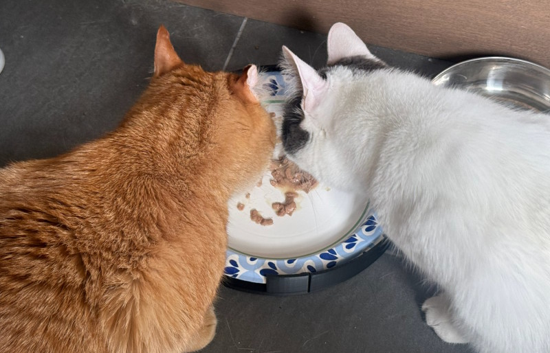
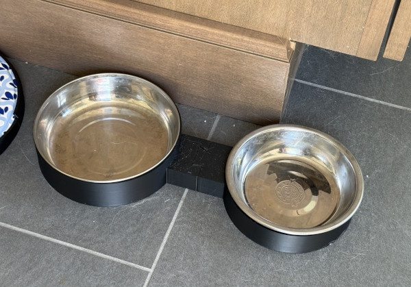

<!-- AUTOGEN:START 2026-05-25 cat food tray holder -->

**Files:**

- SCAD: [2026-05-25 cat food tray holder.scad](2026-05-25%20cat%20food%20tray%20holder.scad)
- STL: [2026-05-25 cat food tray holder.stl](2026-05-25%20cat%20food%20tray%20holder.stl)
<!-- AUTOGEN:END 2026-05-25 cat food tray holder -->

## 2026-05-31 shot glass gauge

I have a few shot glasses that are useful for dispensing liquid medicine. The three levels correspond to 5mL, 10mL, and 15mL for these specific shot glasses.

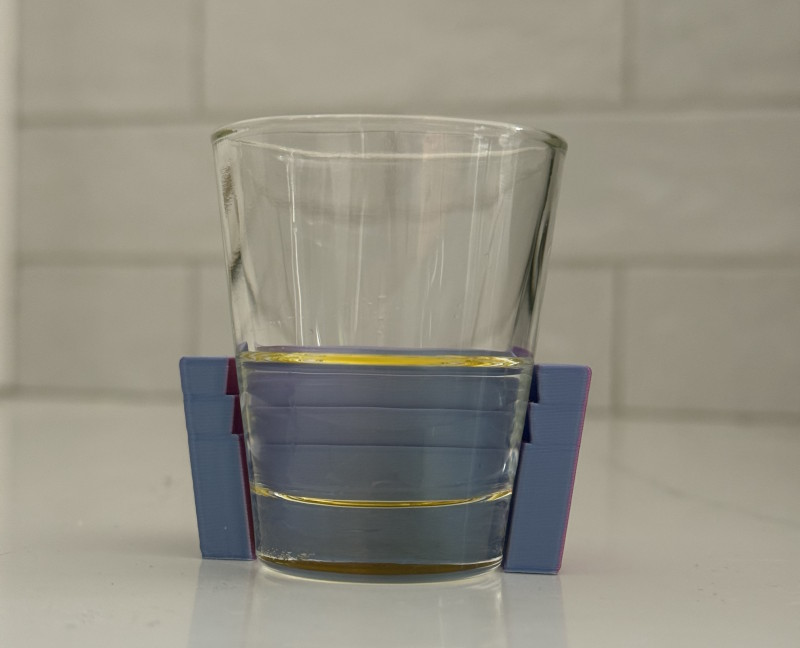
<!-- AUTOGEN:START 2026-05-31 shot glass gauge -->

**Files:**

- SCAD: [2026-05-31 shot glass gauge.scad](2026-05-31%20shot%20glass%20gauge.scad)
- STL: [2026-05-31 shot glass gauge.stl](2026-05-31%20shot%20glass%20gauge.stl)
<!-- AUTOGEN:END 2026-05-31 shot glass gauge -->

## 2025-06-29 webcam wedge to angle it a little differently

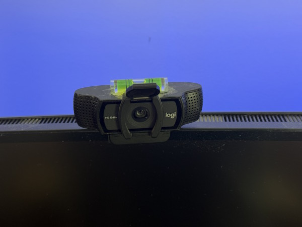
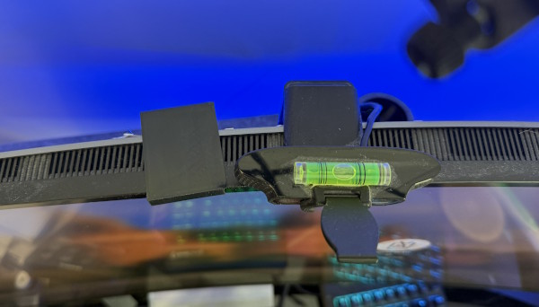

<!-- AUTOGEN:START 2025-06-29 webcam wedge to angle it a little differently -->

**Files:**

- SCAD: [2025-06-29 webcam wedge to angle it a little differently.scad](2025-06-29%20webcam%20wedge%20to%20angle%20it%20a%20little%20differently.scad)
- STL: [2025-06-29 webcam wedge to angle it a little differently.stl](2025-06-29%20webcam%20wedge%20to%20angle%20it%20a%20little%20differently.stl)
<!-- AUTOGEN:END 2025-06-29 webcam wedge to angle it a little differently -->
