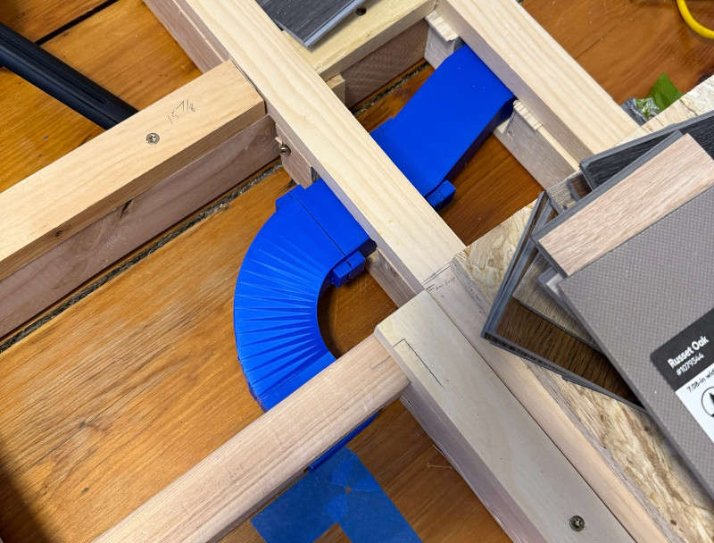
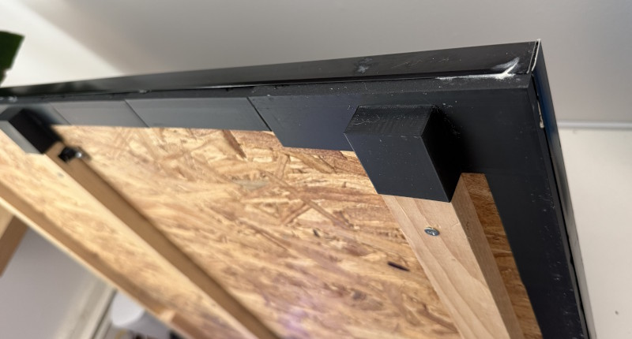
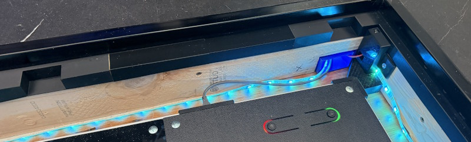
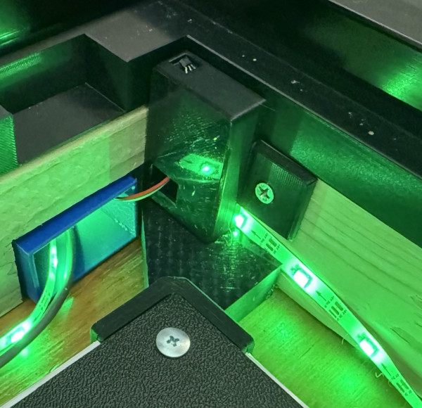
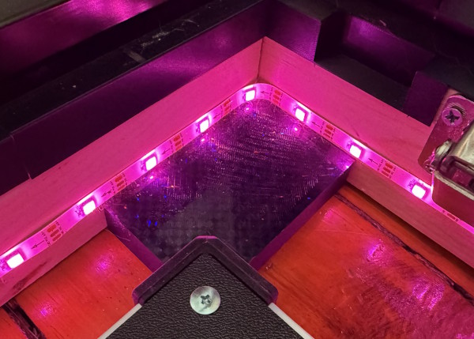
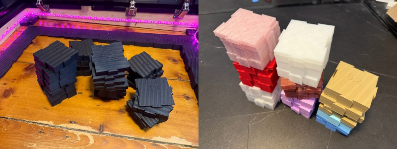
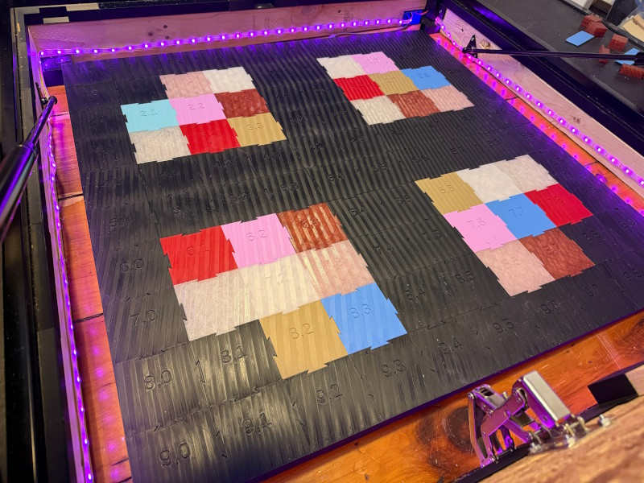

# office floor project

## 2025-03-16 corner protector for raised platform

<!-- AUTOGEN:START 2025-03-16 corner protector for raised platform -->

**Files:**

- SCAD: [2025-03-16 corner protector for raised platform.scad](2025-03-16%20corner%20protector%20for%20raised%20platform.scad)
- STL: [2025-03-16 corner protector for raised platform.stl](2025-03-16%20corner%20protector%20for%20raised%20platform.stl)
<!-- AUTOGEN:END 2025-03-16 corner protector for raised platform -->

## 2025-03-19 trap door prototype

<!-- AUTOGEN:START 2025-03-19 trap door prototype -->

**Files:**

- SCAD: [2025-03-19 trap door prototype.scad](2025-03-19%20trap%20door%20prototype.scad)
- STL: [2025-03-19 trap door prototype.stl](2025-03-19%20trap%20door%20prototype.stl)
<!-- AUTOGEN:END 2025-03-19 trap door prototype -->

## 2025-03-29 conduit for office

<!-- AUTOGEN:START 2025-03-29 conduit for office -->

**Files:**

- SCAD: [2025-03-29 conduit for office.scad](2025-03-29%20conduit%20for%20office.scad)
- STL: [2025-03-29 conduit for office.stl](2025-03-29%20conduit%20for%20office.stl)
<!-- AUTOGEN:END 2025-03-29 conduit for office -->

## 2025-03-30 flooring edges

<!-- AUTOGEN:START 2025-03-30 flooring edges -->

**Files:**

- SCAD: [2025-03-30 flooring edges.scad](2025-03-30%20flooring%20edges.scad)
- STL: [2025-03-30 flooring edges.stl](2025-03-30%20flooring%20edges.stl)
<!-- AUTOGEN:END 2025-03-30 flooring edges -->

## 2025-04-13 lvp placement prototype

<!-- AUTOGEN:START 2025-04-13 lvp placement prototype -->

**Files:**

- SCAD: [2025-04-13 lvp placement prototype.scad](2025-04-13%20lvp%20placement%20prototype.scad)
- STL: [2025-04-13 lvp placement prototype.stl](2025-04-13%20lvp%20placement%20prototype.stl)
<!-- AUTOGEN:END 2025-04-13 lvp placement prototype -->

## 2025-06-29 fast prototype corner piece

<!-- AUTOGEN:START 2025-06-29 fast prototype corner piece -->

**Files:**

- SCAD: [2025-06-29 fast prototype corner piece.scad](2025-06-29%20fast%20prototype%20corner%20piece.scad)
- STL: [2025-06-29 fast prototype corner piece.stl](2025-06-29%20fast%20prototype%20corner%20piece.stl)
<!-- AUTOGEN:END 2025-06-29 fast prototype corner piece -->

## 2025-07-19 ofp ddr corners

<!-- AUTOGEN:START 2025-07-19 ofp ddr corners -->

**Files:**

- SCAD: [2025-07-19 ofp ddr corners.scad](2025-07-19%20ofp%20ddr%20corners.scad)
- STL: [2025-07-19 ofp ddr corners.stl](2025-07-19%20ofp%20ddr%20corners.stl)
<!-- AUTOGEN:END 2025-07-19 ofp ddr corners -->

## 2025-10-19 trap door wedge for disassembly

<!-- AUTOGEN:START 2025-10-19 trap door wedge for disassembly -->

**Files:**

- SCAD: [2025-10-19 trap door wedge for disassembly.scad](2025-10-19%20trap%20door%20wedge%20for%20disassembly.scad)
- STL: [2025-10-19 trap door wedge for disassembly.stl](2025-10-19%20trap%20door%20wedge%20for%20disassembly.stl)
<!-- AUTOGEN:END 2025-10-19 trap door wedge for disassembly -->

## 2025-12-12 level floor 2

<!-- AUTOGEN:START 2025-12-12 level floor 2 -->

**Files:**

- SCAD: [2025-12-12 level floor 2.scad](2025-12-12%20level%20floor%202.scad)
- STL: [2025-12-12 level floor 2.stl](2025-12-12%20level%20floor%202.stl)
<!-- AUTOGEN:END 2025-12-12 level floor 2 -->
