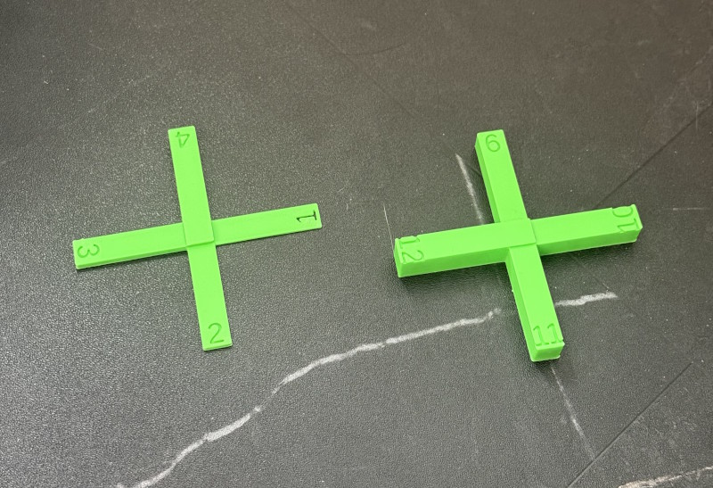
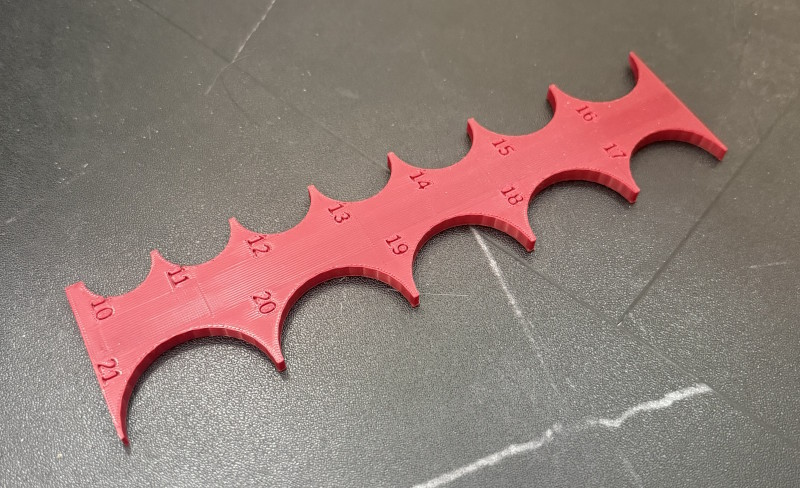
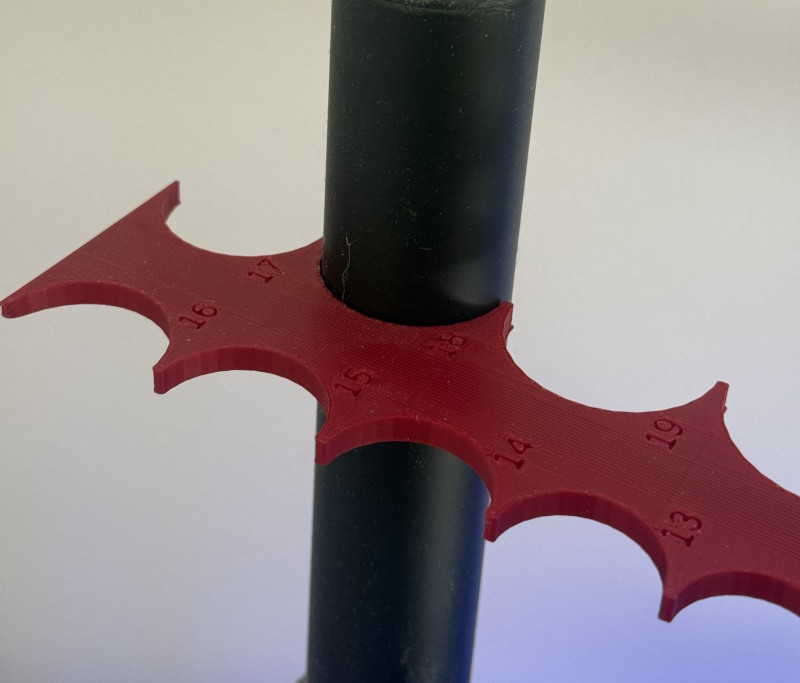
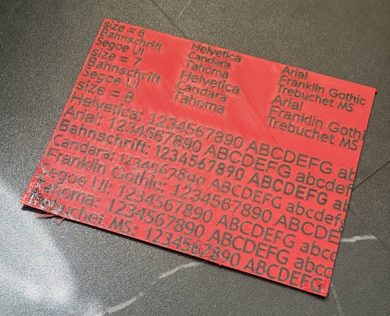
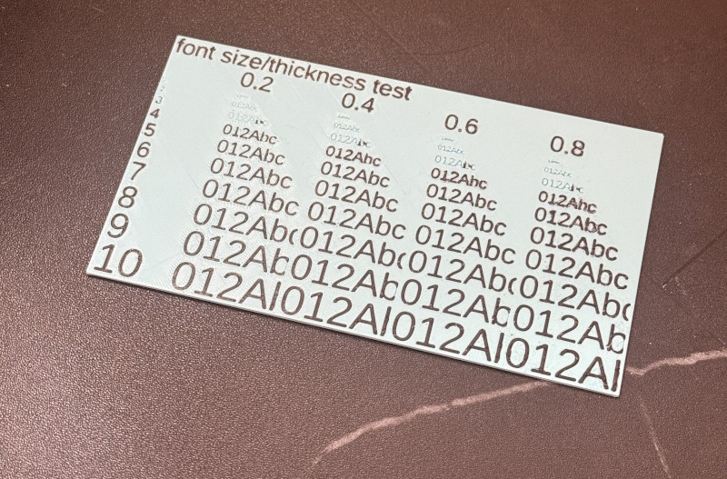

# useful tools

## 2025-04-23 thickness measuring tool

Tool to measure gaps in 1mm increments

<!-- AUTOGEN:START 2025-04-23 thickness measuring tool -->

**Files:**

- SCAD: [2025-04-23 thickness measuring tool.scad](2025-04-23%20thickness%20measuring%20tool.scad)
- STL: [2025-04-23 thickness measuring tool.stl](2025-04-23%20thickness%20measuring%20tool.stl)
<!-- AUTOGEN:END 2025-04-23 thickness measuring tool -->

## 2025-11-28 radius gauge

<!-- AUTOGEN:START 2025-11-28 radius gauge -->

**Files:**

- SCAD: [2025-11-28 radius gauge.scad](2025-11-28%20radius%20gauge.scad)
- STL: [2025-11-28 radius gauge.stl](2025-11-28%20radius%20gauge.stl)
<!-- AUTOGEN:END 2025-11-28 radius gauge -->

## 2025-12-27 font test

<!-- AUTOGEN:START 2025-12-27 font test -->

**Files:**

- SCAD: [2025-12-27 font test.scad](2025-12-27%20font%20test.scad)
- STL: [2025-12-27 font test.stl](2025-12-27%20font%20test.stl)
<!-- AUTOGEN:END 2025-12-27 font test -->

## 2025-12-27 font test 2

<!-- AUTOGEN:START 2025-12-27 font test 2 -->

**Files:**

- SCAD: [2025-12-27 font test 2.scad](2025-12-27%20font%20test%202.scad)
- STL: [2025-12-27 font test 2.stl](2025-12-27%20font%20test%202.stl)
- Variant STL: [2025-12-27 font test 2 - text.stl](2025-12-27%20font%20test%202%20-%20text.stl)
<!-- AUTOGEN:END 2025-12-27 font test 2 -->

## 2026-01-04 joiner prototypes

<!-- AUTOGEN:START 2026-01-04 joiner prototypes -->

**Files:**

- SCAD: [2026-01-04 joiner prototypes.scad](2026-01-04%20joiner%20prototypes.scad)
- STL: [2026-01-04 joiner prototypes.stl](2026-01-04%20joiner%20prototypes.stl)
- 3MF: [2026-01-04 joiner prototypes.3mf](2026-01-04%20joiner%20prototypes.3mf)
<!-- AUTOGEN:END 2026-01-04 joiner prototypes -->
